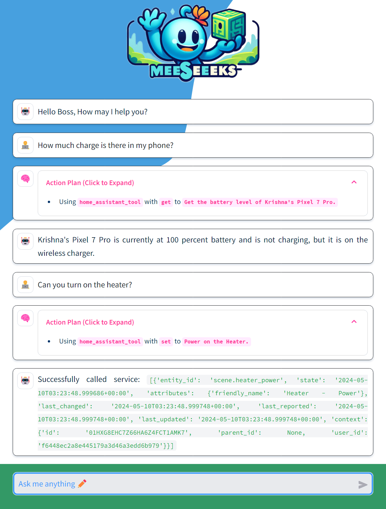

<h1 align="center">Meeseeks: The Personal Assistant 👋</h1>

> Look at me, I'm Mr Meeseeks.




## Project Motivation 🚀
Meeseeks is an AI assistant powered by a multi-agent large language model (LLM) architecture that breaks down complex problems into smaller, more manageable tasks. These tasks are then handled by autonomous agents, which leverage the reasoning capabilities of LLMs. By decomposing problems into smaller queries, Meeseeks significantly improves caching efficiency, especially when combined with semantic caching techniques.

The project takes advantage of various models through OpenAI-compatible endpoints (Lite-LLM, vLLM, ollama text-generation-ui, etc.) to interact with various self-hosted and cloud inference models. This approach allows users to benefit from privacy by using local models ([`microsoft/phi-3-mini-128k-instruct`](https://huggingface.co/microsoft/Phi-3-mini-128k-instruct), [`meta-llama/Meta-Llama-3-8B`](https://huggingface.co/meta-llama/Meta-Llama-3-8B), etc) and performance of cloud inference models (`anthropic/claude-3-opus`, `openai/gpt-4-turbo`, etc)

Meeseeks builds upon recent advancements in LLM-based multi-agent systems, which have shown promising results in collaborative problem-solving, RAG, consensus-seeking, and theory of mind inference in cooperative settings. By harnessing the planning and decision-making capabilities of LLMs, Meeseeks should provide an efficient and effective solution for handling complex tasks across various tools.

## Features 🔥
| Completed | In-Progress | Planned | Scoping |
| :-------: | :---------: | :-----: | :-----: |
|     ✅     |      🚧      |    📅    |    🧐    |


| Status | Feature                                                                                                                                                                                                 |
| :----: | ------------------------------------------------------------------------------------------------------------------------------------------------------------------------------------------------------- |
|   ✅    | [LangFuse](https://github.com/langfuse/langfuse) integrations to accurate log and monitor chains.                                                                                                       |
|   ✅    | Use natural language to interact with integrations and tools.                                                                                                                                           |
|   ✅    | Decomposes user queries to a `TaskQueue` with a list of `ActionSteps`.                                                                                                                                  |
|   🚧    | Custom [Home Assistant Conversation Integration](https://www.home-assistant.io/integrations/conversation/) to allow voice assistance via [**HA Assist**](https://www.home-assistant.io/voice_control/). |
|   🧐    | **(Extras - Quality)** Use CRITIC reflection framework to reflect on a response to a task/query using external tools via `llama_index.agent.introspective.ToolInteractiveReflectionAgentWorker`.        |
|   📅    | **(Extras - Privacy)** Integrate with [microsoft/presidio](https://github.com/microsoft/presidio) for customizable PII de-identification.                                                               |
|   ✅    | A chat Interface using `streamlit` that shows the action plan, user types, and response from the LLM.                                                                                                   |

### Integrations

| Status |             Integration Name             | Description                                                                                                                       |
| :----: | :--------------------------------------: | --------------------------------------------------------------------------------------------------------------------------------- |
|   ✅    |            Home Assistant API            | Control devices and retrieve sensor data via `request`                                                                            |
|   📅    |                  Gmail                   | Access Gmail functionality via `llama_index.tools.google.GmailToolSpec`                                                           |
|   🚧    |             Google Calendar              | Access Google Calendar functionality via `llama_index.tools.google.GoogleCalendarToolSpec`                                        |
|   📅    |              Google Search               | Perform Google search via `llama_index.tools.google.GoogleSearchToolSpec`                                                         |
|   📅    | Search recent ArXiv papers and summaries | Search and retrieve summaries of recent ArXiv papers via `llama_index.tools.arxiv.ArxivToolSpec`                                  |
|   📅    |              Yahoo Finance               | Access stock, news, and financial data of a company from Yahoo Finance via `llama_index.tools.yahoo_finance.YahooFinanceToolSpec` |
|   📅    |                   Yelp                   | Search for businesses and fetch reviews from Yelp via `llama_index.tools.yelp.YelpToolSpec`                                       |
|   🧐    |         Android Debugging Shell          | Use Home Assistant ADB Integrations to perform actions on Android TV Variants via `integrations.HomeAssistant`.                   |


## Project Setup 🛠️

1. **Environment Setup**: This project requires Python 3.7 or later. It is recommended to use a virtual environment to manage the project dependencies. You can create a virtual environment using the following command:

    ```sh
    python3 -m venv env
    ```

2. **Activate the Virtual Environment**: Activate the virtual environment using the following command:

    ```sh
    source env/bin/activate  # On Windows use `env\Scripts\activate`
    ```

3. **Install Dependencies**: Install the project dependencies from the [``requirements.txt``](requirements.txt) file using the following command:

    ```sh
    pip install -r requirements.txt
    ```

4. **Environment Variables**: Copy the [``.env.example``](.env.example") file to a new file named ``.env`` and fill in the necessary environment variables.

## Running the Streamlit Web Interface

To run the Streamlit app [``chat_master.py``](chat_master.py"), use the following command:

```sh
streamlit run chat_master.py
```

## Contributing 👏

We welcome contributions from the community to help improve Meeseeks. Whether you want to fix a bug, add a new feature, or integrate a new tool, your contributions are highly appreciated.

To contribute to Meeseeks, please follow these steps:

1. Fork the repository and clone it to your local machine.
2. Create a new branch for your contribution.
3. Make your changes, commit your changes and push them to your forked repository.
4. Open a pull request to the main repository, describing your changes and the problem they solve.

## Bug Reports and Feature Requests 🐞

If you encounter any bugs or have ideas for new features, please open an issue on our [issue tracker](https://github.com/bearlike/Personal-Assistant/issues). We appreciate detailed bug reports that include steps to reproduce the issue and any relevant error messages.


Thank you for considering contributing to Meeseeks! Let's build cool stuff!

## Additional Resources 📚
- [vllm-project/vLLM](https://github.com/vllm-project/vllm): A high-throughput and memory-efficient inference and serving engine for LLMs
- [BerriAI/Lite-LLM](https://github.com/BerriAI/litellm): Call 100+ LLM APIs using the OpenAI API format.
- [ollama/ollama](https://github.com/ollama/ollama): Get up and running with Llama 3, Mistral, Gemma, and other large language models locally.
- [oobabooga/text-generation-webui](https://github.com/oobabooga/text-generation-webui): A Gradio web UI for Large Language Models. Supports transformers, GPTQ, AWQ, EXL2, llama.cpp (GGUF), Llama models.


